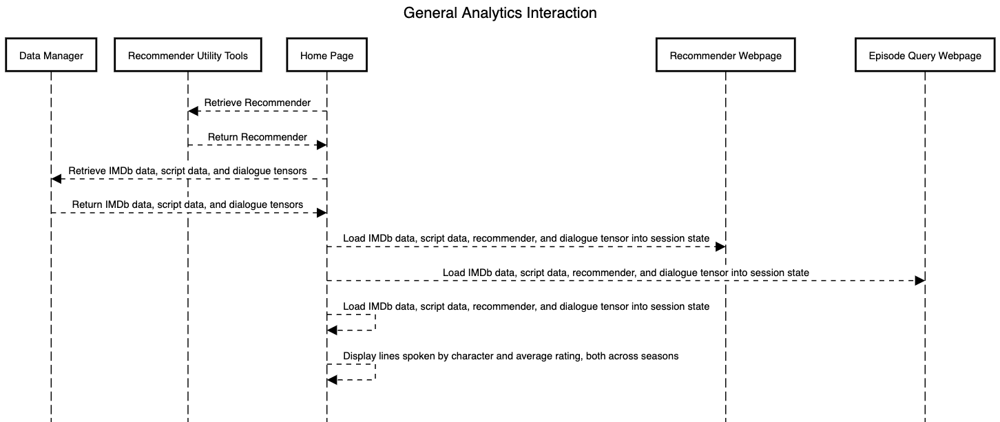
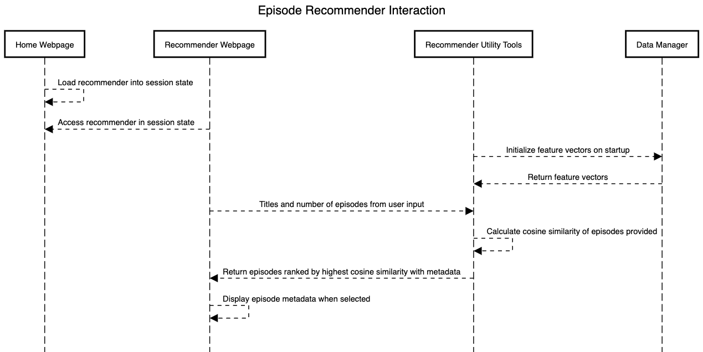
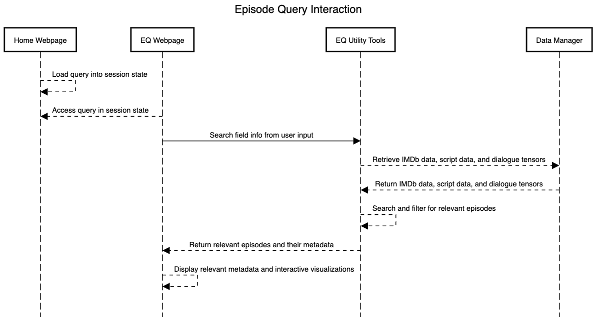

# Component Specification

## Software Components

### Data Manager
The data manager handles all data to be loaded and stored upon each iteration of loading the website. This includes:

- Episode metadata (such as title, season, rating, description, key words, director, etc.)
   - Input: CSV file accessed via a local path in Data Constants (below)
   - Output: Data in the form of a Pandas DataFrame

- Episode scripts (line by line dialogue for each episode and their sentiment scores)
   - Input: CSV file accessed via a link in Data Constants (below)
   - Output: Data in the form of a Pandas DataFrame

- Feature vector for dialogue feature
   - Input: .NPY files stored within the GitHub repository (an_analysis_of_nothing/an_analysis_of_nothing/static/data/dialogue_tensors), which were      generated via Precompute Tools (below).
   - Output: A torch tensor containing the encoded dialogue feature

It also provides application specific features like line and characters counts for recommendation.

#### Data Constants
This .py files contains only constants with links to the publically stored Google Drive data needed to load episode metadata and episode scripts. 
- Inputs: None
- Outputs: local path to datasets

#### Precompute Tools
Stored under the /scripts directory, this component includes tools that are not run upon each website reload, but were necessary to generate the final data accessed by the data manager. 
- Inputs: Episode scripts data
- Outputs: Sentiment metrics and vector representations for each line of dialogue

### Recommender Utility Tools
Contains a class to create and store all recommendation features for content-based recommendation upon user input on the Recommender Webpage (below).
The feature generator uses dialogue, key words, sumamries, ratings, sentiment, and the number of lines per character to generate encodings using a sentence transformer model for each Seinfeld episode. These are then used to recommend similar episodes via cosine similarity.

- Inputs: Cleaned episode metadata and script data from Data Manager
- Outputs: DataFrame of recommended episodes ranked by similarity. 

### Episode Query Utility Tools
Contains functions primarily to generate a feature vector of user input via encoding performed by a sentence transformer model, which is then used for episode querying. Upon user input, the tool will return the top five most similar episodes via cosine similarity to the dialogue tensor accessed from Data Manager. This component also contains functions to filter episode data prior to querying based on users' Advanced Search selections, such as seasons or characters of interest. This component also includes implementation of streamlit-aggrid tables, which allows for user interaction via episode selection (clicking) following querying. This component also contains helper functions for formatting data for interactive visualizations displaying sentiment statistics. Lastly, this component includes helper functions for all previously mentioned functionalities. 

- Inputs: Cleaned episode metadata and script data, as well as dialogue feature vectors from Data Manager
- Outputs: AgGrid object containing the query response

### Home Page
This component, in tandem with app.py (below) combines all visual elements and implements all utility tools to create the Streamlit landing webpage. Its primary function is to load all data, as well as the Recommender tool and dialogue vectors for querying, into the Streamlit session state, allowing for fast computation. It also acts as the home page for navigation to other pages (containing recommendation and querying functionality). Finally, this component creates and displays general descriptive analytics, which can be filtered via user-inputted season selection. 

- Inputs: All data from Data Manager, static images 
- Outputs: 
   - Landing page with sidebar linking to other webpages, and plots displaying character/season/rating statistics. 
   - DataFrames, dialogue tensor, and Recommender loaded into session state until webpage is reloaded.

### Recommender Webpage
The Recommender Webpage is the UI for the episode recommendation system, which recommends the user specific episode(s) based on episodes they already like. It does so by running all Recommender Utility Tools, and also calling additional python code to integrate Streamlit functions such as a dropdown menu to select the number of recommendations desired, a multiselect box to input episodes to base the recommendation off of, and markdown to view an episode's IMDb description upon clicking. 

- Inputs: Recommender Utility Tools, static images
- Outputs: Streamlit UI that displays:
   - Tools for user to input chosen episode(s) and number of target episodes. 
   - Clickable AgGrid frame depicting n episodes (where n is the specified target number), ranked from most to least similar.
   - Additional markdown and design elements for title, instructions, episode description, etc.

### Query Webpage 
The Query Webpage is the UI for the episode query system, which allows the user to input search criteria and find a specific episode. It does so by running all Episode Query Utility Tools. It also calls additional python code to integrate Streamlit functions such as a search bar, dropdowns and sliders for display and toggling of the sidebar for episode filtering, and markdown to view an episode's IMDb description upon clicking. 

- Inputs: Episode Query Utility Tools, static images
- Outputs: Streamlit UI that displays:
   - Searchbar for user to input textual key words, lines, or scenes
   - UI controls for season(s), episode rating(s), and speaking character(s) selection
   - Clickable AgGrid frame depicting up to five episodes, ranked from most to least similar to the input query
   - Plotly bar chart and sunburst chart displaying episode-level and character-level sentiment statistics
   - Additional markdown and design elements for title, instructions, episode description, etc

### About Us Webpage
The About Us Webpage contains no interactive elements, but acts as a descriptive tab for project background and creators.

- Inputs: Static images
- Outputs: Basic Streamlit UI with background information

## Interactions

### General Analytics

The Home Page is displayed via the app.py subcomponent, and loads the data and recommender into the session state for the entire duration of all interactions via the Data Manager. The items in session state are now available for the Recommender Webpage and Query Webpage. The Home Page then interacts with itself to display interactive bar and line charts with general character/rating analytics. 

 

### Episode Recommendation

The Recommender Webpage is displayed via the Home Page component and app.py subcomponent, which load the data and recommender into the session state for the entire duration of all interactions. The Recommender Webpage then receives user input, which is inputted into the Recommender Utility Tools. The Recommender Utility Tools then create feature vectors using the Data Manager and return the list of ranked episode recommendations as an AgGrid object. This is fed back to the Recommender Webpage, which displays the recommended episodes and additional metadata.

 

### Episode Querying

The Query Webpage is displayed via the Home Page component and app.py subcomponent, which load the data and dialogue feature vectors into the session state for the entire duration of all interactions. The Query Webpage then receives user input via the search query and the sidebar filters, which is inputted into the Episode Query Utility Tools. The Episode Query Utility Tools then returns the episodes most similar to the user query as an AgGrid object, as well as data formatted for sentiment statistic plots. This is fed back to the Episode Querying Webpage, which displays the queried episodes, additional medata, and sentiment visualizations.

 

## Preliminary Plan

1. Scrape the data
    * Dialogue dataset
    * Episode metadata dataset
    * Rating info for each episode dataset
    * Episode summaries and keywords dataset
2. Clean the data
    * Matching episodes across all sources
3. Sketch website - create an initial design
4. Write test cases
5. Implement unified feature generation
    * Lines per episode
    * Episode sentiment
    * Line sentiment
    * Overall episode focus (to potentially update IMDb keywords for each episode)
    * Calculate cosine similarities
6. Implement visualization of episode metrics
7. Implement Episode Search Query 
8. Implement Episode Recommender

