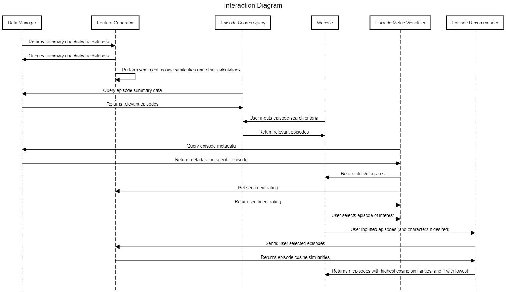

#Component Specification

##Software Components

### Data Manager

The data manager provides an interface to the episode metadata, episode dialogue, and similarity metric datasets. It provides application specific features like querying the dialogue from the episode dialogue dataset or episode characteristics like viewer rating.

- Inputs: CSV files
- Outputs: Queried, cleaned data

### Feature Generator

The feature generator computes the sentiment of each line, the number of lines for each character and compares it to a baseline of spoken lines, and cosine similarity of episodes.

- Inputs: Cleaned queried data from Data Manager
- Outputs: New features that can be updated upon, as listed above.

### Episode Search Query

The episode query finds episodes from key words and character, season, sentiment and rating selection.

- Inputs: User inputted key words, character, season, sentiment and/or rating
- Outputs: Episodes that fit the user inputted criteria

### Episode Metric Visualizer

The episode metric visualizer metadata from the data manager to generate plots.

- Inputs: Episode metadata of interest to the user
- Outputs: Diagrams and plots. 

### Episode Recommender

The episode recommendation system recommends the user specific episode(s) based on a certain search criteria.

- Inputs: Chosen episode(s) and number of target episodes. Advanced search criteria → Character(s) of interest, seasons, etc. 
- Outputs: List of n episodes (where n is the specified target number), ranked from most to least similar.

## Interactions

### Episode Recommendation

On the website, the user can select episodes they liked and the **Episode Recommender** will retrieve the cosine similarities from the **Feature Generator** and select n episodes with the highest cosine similarities to the user inputted episodes and one with the least. These episodes are then displayed to the user on the website. If the user wants a more advanced recommendation, they can also select a character of interest. 

### Episode Querying

The user uses the search bar on the website to enter general events/occurrences (i.e. “mean guy serving soup”). The **Episode Search Query** component then accesses the episode summaries and keywords dataset from the **Data Manager**. The episodes that best fit the search criteria are returned and displayed to the user on the website. The user can also select the advanced search button and also input keywords, seasons of interest, characters of interest or episode rating as a range. Out of the returned episodes, the user can select one to view its analytics. 

### Descriptive Analytics

Once the user selects an episode, the **Episode Metric Visualizer** retrieves the episodes metadata from the **Data Manager**. It then creates standard plots/diagrams with that episode's analytics. These plots/diagrams are displayed to the user on the website.

##Preliminary Plan

1. Scrape the data
* Dialogue dataset
* Episode metadata dataset
* Rating info for each episode dataset
* Episode summaries and keywords dataset
2. Clean the data
* Matching episodes across all sources
3. Sketch website - create an initial design
4. Write test cases
5. Implement unified feature generation
* Lines per episode
* Episode sentiment
* Line sentiment
* Overall episode focus (to potentially update IMDb keywords for each episode)
* Calculate cosine similarities
6. Implement visualization of episode metrics
7. Implement Episode Search Query 
8. Implement Episode Recommender

