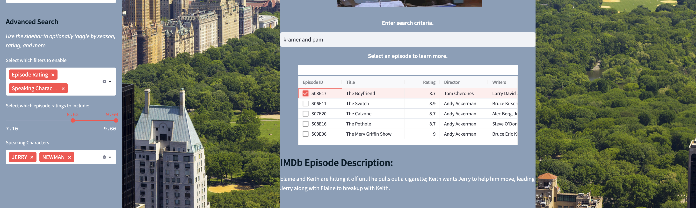

Check out the ```/examples/README.md``` to learn how to view our website online, or locally!

### Home Page

Beginning on the landing home page, view general descriptive analytics about Jerry, George, Kramer, and Elaine's spoken lines across different seasons of Seinfeld. Select up to all nine seasons and see how often your favorite characters were speaking, as well as the seasons' ratings over the years.

Click to filter, scroll, and zoom.


### Episode Recommendation

Users can navigate to the Episode Recommendation tab to find new episodes based on the ones they already love. Use the dropdown menu to select how many recommendations to view, and search and enter the titles of some previously enjoyed episodes.

Within seconds, view recommendations based on sentiment, lines spoken, episode key words, and more. Then click on any recommended episode to view its IMDb description.


### Episode Querying

For fans who are looking for specific episode lines, dialogues, or scenes, or general users who're not sure what episode to use for recommendation, the Query Episodes tab allows for filtered search of all Seinfeld episodes. 

Navigate to the search bar and enter any search criteria, and view up to five recommendations ranked by similarity to the input query. Additionally, use the sidebar to filter by up to nine seasons, select any characters of interest, and toggle to filter minimum and maximum episode ratings.



Upon receiving a response, click any returned episode to view its IMDb description, as well charts depicting the average sentiment of the episode and the average sentiment of all characters present in the episode. Zoom, scroll, hover and click on any character name to learn more.


### About Us

Navigate to this tab to learn more background information about this UW DATA515 project.


## Live Demo

[Website Demo](https://drive.google.com/file/d/1KPQyFiidUAzbk1oaAdEksbGXqCCfxCCf/view)
